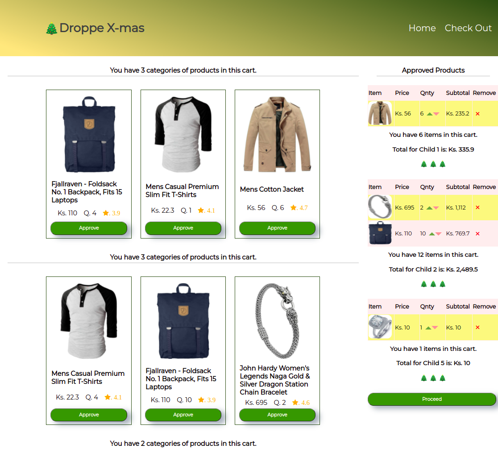

# Droppe X-mas

- A Custom design Shopping Cart made using HTML, CSS & ReactJs.

## Getting Started with This App

To run on the local develpoment server, you need to install npm and node.

    - Download project from the repository on GitHub
    - Run 'npm install' at projects root to install application
    - Add React Router by running 'npm i -D react-router-dom' in the root
    - Run 'npm start' to start the development server
    - Open [http://localhost:3000](http://localhost:3000) to view it in your browser.

    The page will reload when you make changes.

## See it [Live](https://droppe-gift-cart.netlify.app/)

## Screenshot

### Flow
- Atomic design was taken into consideration (Est timeline - 2h).
- React components have been implemented for the Product carts, Content, Sidbar and the Footer (Est timeline - 2h).
- React hooks were used to manage the component state (Est timeline - 2.5h).
- Simple animations have been created using CSS (Est timeline - 2h).
- The project was published on Netlify (Est timeline - 15 min)

### Technologies used

- HTML & CSS
- JavaScript | Reactjs

## Implementation

## Folder Structure
src:
- Components
    - ApprovedTable
    - Checkbutton
    - Checkoutpage
    - Layout
    - Main
    - Modal
- App.js
- index.css
- utils.js

### work-up:

    - 5 carts were pulled from the API—one per child, it is visible which cart is which childs
    - The user can interact with these carts in an intuitive way to manage spending per child
    - The user gets a discount if there are identical products on the childrens carts and the user approves these wishes
    -   2 identical products chosen => 20% reduction for the sum of those two items
    -   3 identical products chosen => 30% reduction — these reduction rules are handled on the client
    -When the user has made the final choices of approving certain products, these choices are shown in different carts.

### Deployment

This project was deployed on Netlify. Visit the site on: [Live](https://droppe-gift-cart.netlify.app/)
